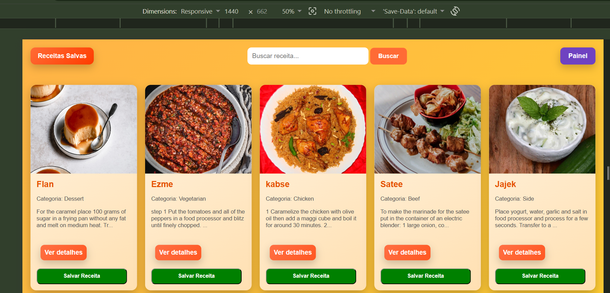
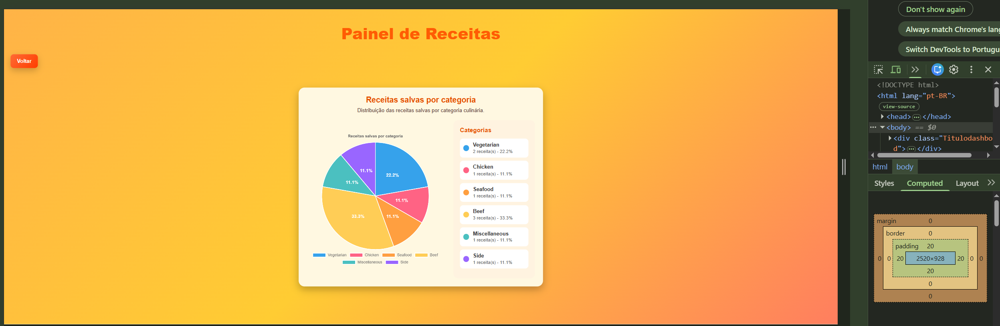

# Trabalho Prático - Semana 14

A partir dos dados disponíveis em seu projeto, vamos explorar formas de visualização que permitam apresentar essas informações de maneira clara, interativa e significativa. Você poderá utilizar gráficos (barras, linhas, pizza), mapas, calendários ou outras formas de visualização. Seu desafio é desenvolver uma página Web capaz de organizar, processar e exibir os dados de forma compreensível e visualmente atraente.

Com base no tipo de projeto escolhido, você deverá propor **visualizações que estimulem a interpretação, o agrupamento e a apresentação criativa dos dados**, trabalhando tanto os aspectos lógicos quanto os visuais da aplicação.

Sugerimos o uso das seguintes ferramentas acessíveis: [FullCalendar](https://fullcalendar.io/), [Chart.js](https://www.chartjs.org/), [Mapbox](https://docs.mapbox.com/api/), para citar algumas.

## Informações Gerais

- Nome: Talles Henrique Santos Silva
- Matrícula: 928467
- Proposta de projeto escolhida: Criar um grafico que contabiliza  as  categorias de receita que usuario gostou  
- Breve descrição sobre seu projeto: A proposta do site é permitir que os usuários pesquisem receitas de forma simples e rápida. Ao encontrar uma receita de interesse, o usuário pode visualizar seus detalhes, como ingredientes e modo de preparo. Caso goste da receita, ele pode salvá-la em uma área de favoritos. Dessa forma, todas as receitas salvas ficam armazenadas em uma página específica, permitindo que o usuário acesse suas receitas preferidas sempre que desejar.

**Print da tela com a implementação**

<< Coloque aqui uma breve explicação da implementação feita nesta etapa>>
A ideia do gráfico é contabilizar as receitas que os usuários mais gostaram ou salvaram como favoritas. Assim, será possível visualizar quais receitas tiveram mais interesse dos usuários.
<<  COLOQUE A IMAGEM DA TELA 1 AQUI >>

<<  COLOQUE A IMAGEM DA TELA 2 AQUI >>
